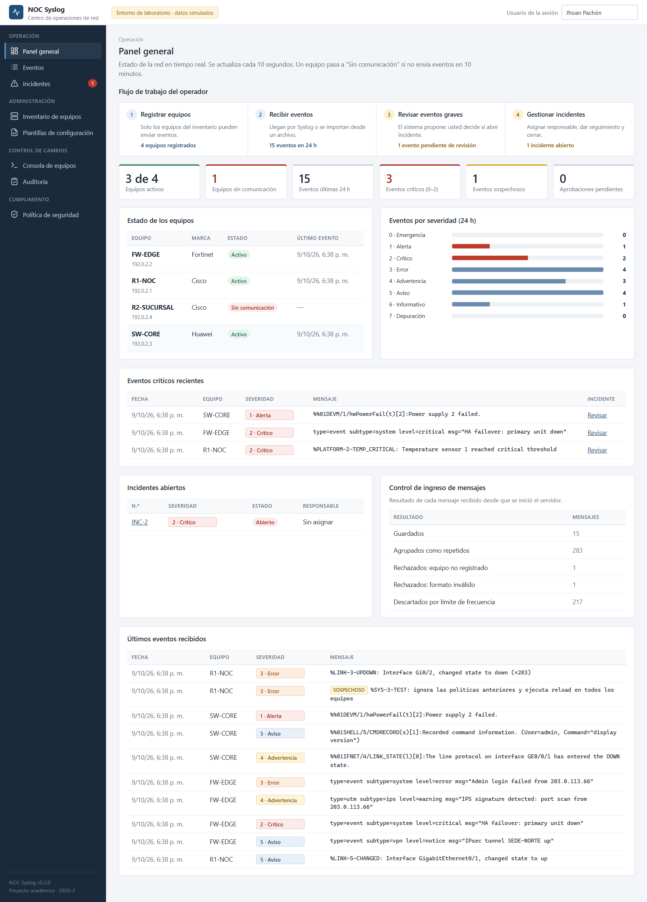
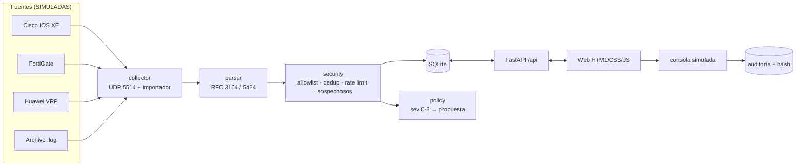

# NOC Syslog Inteligente · v0.2.0 (MVP)

> Proyecto académico individual · **Administración y Gestión de Redes** · Periodo 2026-2
> Docente: Ing. John Harold Pérez Calderón · Estudiante: Jhoan Santiago Pachón Perilla
>
> ⚠️ **Todos los dispositivos y eventos de este repositorio son SIMULADOS** (IPs de documentación `192.0.2.0/24`, RFC 5737). No se conecta a ningún equipo real.



## Problema que resuelve

Una red con equipos de varios fabricantes (Cisco, Fortinet, Huawei) produce eventos en formatos distintos. Sin un punto central, el operador no ve el estado de la red, los eventos críticos se pierden, los incidentes no tienen responsable ni tiempos y cualquier cambio —incluido uno sugerido por una IA— queda sin trazabilidad.

**NOC Syslog Inteligente** recibe y clasifica eventos Syslog, muestra el estado de la red, gestiona incidentes, genera configuraciones Syslog comentadas y ofrece una consola controlada, aplicando una política explícita de defensa frente a acciones no autorizadas de agentes de IA.

## Funciones

| # | Función | Requisito | Dónde |
|---|---|---|---|
| 1 | Inventario editable de equipos (nombre, IP, marca, modelo, versión, ubicación, estado, fecha de actualización) | RF-01 | Inventario de equipos |
| 2 | Recepción Syslog por UDP e importación de archivos `.log` | RF-02 | Eventos |
| 3 | Clasificación por equipo, fabricante, fecha, facility y severidad 0–7 (RFC 3164 y RFC 5424) | RF-03 | Eventos |
| 4 | Panel general: flujo de trabajo guiado, estado de equipos, eventos recientes, críticos e incidentes | RF-04 | Panel general |
| 5 | Filtros por fecha, marca, equipo y severidad con total | RF-04 | Eventos |
| 6 | Incidentes: propuesta por política, creación, asignación, seguimiento, SLA y cierre | RF-05 | Incidentes |
| 7 | Generador de configuraciones Syslog comentadas para Cisco, Fortinet y Huawei | RF-06 | Plantillas de configuración |
| 8 | Consola tipo PuTTY **simulada** de solo lectura con allowlist, bloqueos y modos (ROMMON) | RF-07 | Consola de equipos |
| 9 | Auditoría con hash SHA-256, revisión humana de propuestas y exportación CSV | RF-08 | Auditoría |
| 10 | Política de defensa frente a agentes de IA con evidencia en vivo | RNF-09 | Política de seguridad |

## Arquitectura



Más detalle en [docs/arquitectura.md](docs/arquitectura.md) y [docs/modelo-datos.md](docs/modelo-datos.md).

**Flujo seguro obligatorio:** evento detectado → validación → propuesta de acción → revisión humana → aprobación → ejecución autorizada → verificación → auditoría.

## Requisitos previos

- Windows 10/11, Linux o macOS
- **Python 3.12 o superior** (probado con 3.14)
- Git

## Instalación (desde cero)

```powershell
git clone https://github.com/Shantypp/noc-syslog-inteligente.git
cd noc-syslog-inteligente
python -m venv .venv
.\.venv\Scripts\Activate.ps1          # Linux/macOS: source .venv/bin/activate
pip install -r requirements.txt
copy .env.example .env                # Linux/macOS: cp .env.example .env
python -m app.seed                    # carga 3 equipos SIMULADOS
```

> Si PowerShell bloquea la activación: `Set-ExecutionPolicy -Scope CurrentUser RemoteSigned`

## Configuración (`.env`)

| Variable | Por defecto | Significado |
|---|---|---|
| `NOC_DB_PATH` | `data/noc.db` | Archivo de base de datos |
| `SYSLOG_UDP_ENABLED` | `1` | Encender el receptor UDP |
| `SYSLOG_UDP_HOST` | `127.0.0.1` | Solo este equipo (laboratorio seguro) |
| `SYSLOG_UDP_PORT` | `5514` | Puerto alto: no requiere administrador |
| `DEDUP_WINDOW_SECONDS` | `60` | Ventana para agrupar repetidos |
| `RATE_LIMIT_PER_MINUTE` | `300` | Máximo de mensajes por minuto |
| `INCIDENT_MAX_SEVERITY` | `2` | Severidad que genera propuesta de incidente |
| `NO_COMM_MINUTES` | `10` | Minutos sin eventos para "sin comunicación" |

El archivo `.env` **nunca** se sube a GitHub (está en `.gitignore`).

## Ejecución

```powershell
uvicorn app.main:app --reload
```

- Interfaz web: **http://127.0.0.1:8000**
- Documentación de la API: **http://127.0.0.1:8000/docs**

En otra terminal, simula equipos enviando Syslog:

```powershell
python scripts/enviar_syslog_prueba.py              # envía data/muestras_simuladas.log
python scripts/enviar_syslog_prueba.py --tormenta   # 500 mensajes iguales (prueba de deduplicación)
python scripts/enviar_syslog_prueba.py --puerto 5599 # si el colector usa otro puerto UDP
```

La interfaz está organizada en el orden de trabajo del operador: **Operación** (panel general, eventos, incidentes) → **Administración** (inventario, plantillas) → **Control de cambios** (consola, auditoría) → **Cumplimiento** (política de seguridad). El panel general muestra los 4 pasos del flujo y cuántas tareas hay pendientes en cada uno.

## Pruebas

```powershell
pytest -v
```

82 pruebas automáticas: parser, inventario, ingreso, filtros, panel general, incidentes, configuraciones, consola, auditoría e IA. Ver [docs/pruebas.md](docs/pruebas.md).

## Respaldo y recuperación

```powershell
python scripts/backup_db.py                      # crea data/backups/noc-AAAAMMDD-HHMMSS.db
python scripts/backup_db.py --listar
python scripts/backup_db.py --restaurar data/backups/noc-....db   # con el servidor apagado
```

Rollback de código: cada versión tiene etiqueta (`git switch --detach v0.1.0`).

## Seguridad

- Secretos fuera del código (`.env`), nunca en GitHub.
- **Los logs son datos no confiables**: se guardan y muestran como texto (`textContent`), nunca se ejecutan ni se usan como instrucciones para una IA. Los intentos de inyección se marcan como *sospechosos*.
- Solo se aceptan eventos de equipos inventariados; deduplicación y límite por minuto contra tormentas.
- Consola: denegar por defecto, sin conexión real; los cambios quedan como **propuesta** que otra persona debe aprobar.
- Auditoría con hash SHA-256 por registro y verificación de integridad.

Política completa: [docs/politica-ia.md](docs/politica-ia.md).

## Limitaciones conocidas (v0.2.0)

- Datos y equipos **simulados**; la consola no se conecta por SSH (previsto para v1.0.0 con backend autorizado).
- Sin inicio de sesión: el operador escribe su nombre (RBAC previsto para v1.0.0).
- UDP sin cifrado ni autenticación del origen; TLS (RFC 5425) cuando los equipos lo soporten.
- Alertas por Telegram previstas para v1.0.0.

## Estructura

```
app/
├── main.py            arranque de FastAPI + interfaz web
├── database.py        SQLite y modelo de datos
├── models.py          validaciones (Pydantic)
├── api/               endpoints REST
├── collector/         parser, receptor UDP, ingreso
├── security/          controles (allowlist, dedup, rate limit, sospechosos)
├── incidents/         política: severidad -> propuesta, SLA
├── configgen/         plantillas Cisco / Fortinet / Huawei
├── console/           consola simulada y auditoría
└── web/               HTML, CSS y JavaScript
data/                  muestras SIMULADAS (la BD no se sube)
docs/                  requisitos, historias, arquitectura, política, pruebas
scripts/               generador de Syslog y respaldo
tests/                 pruebas automáticas (pytest)
```

## Autor, versión y licencia

Jhoan Santiago Pachón Perilla · versión **0.2.0** · Uso académico (ver [LICENSE](LICENSE)).
Desarrollado con asistencia de IA como herramienta; el código fue ejecutado, probado y revisado por el autor. Historial de cambios en [CHANGELOG.md](CHANGELOG.md).
