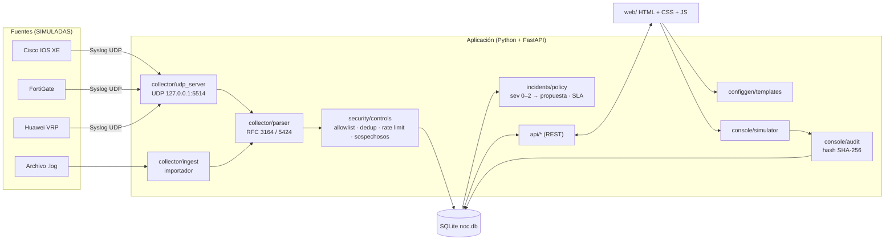
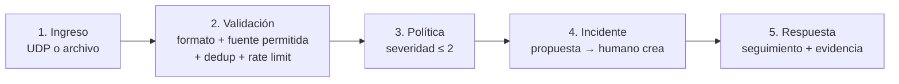
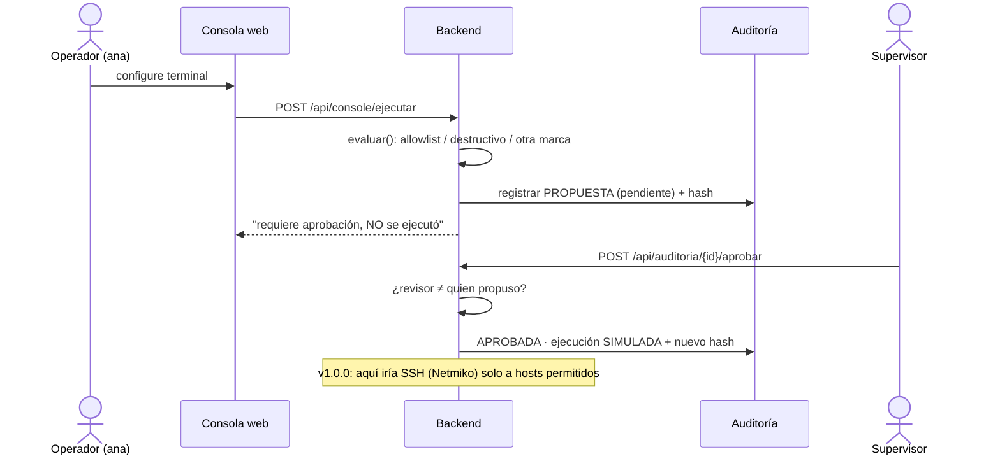

# Arquitectura

## Componentes

## Flujo lógico del curso

## Flujo seguro de acciones

## Decisiones (ADR)

| ADR | Decisión | Motivo |
|---|---|---|
| 001 | Python + FastAPI + SQLite + HTML/JS sin frameworks | Simple de instalar y explicar; `/docs` permite probar la API; Netmiko (SSH, Corte 3) es Python |
| 002 | Los logs son datos no confiables | Evita inyección de prompt indirecta y XSS |
| 003 | La política propone, el humano decide | Flujo seguro obligatorio; evita escalada autónoma |
| 004 | Receptor en 127.0.0.1:5514 por defecto | Laboratorio seguro sin permisos de administrador |
| 005 | Validación de comandos en el backend | En el navegador se puede saltar con F12 |
