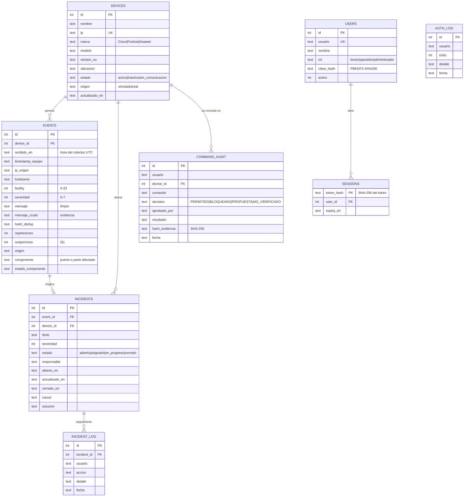

# Modelo de datos (SQLite)

## Decisiones de diseño

- **`origen`** en equipos y eventos: los datos simulados quedan identificados (regla del curso).
- **`mensaje_crudo`** conserva el texto exacto recibido (evidencia); **`mensaje`** es la versión limpia que se muestra.
- **`hash_dedup`** = SHA-256(equipo + severidad + mensaje) → agrupa repetidos en una ventana de 60 s.
- **`sospechoso`** marca patrones de inyección; el evento se guarda igual (no se destruye evidencia).
- **`hash_evidencia`** = SHA-256(usuario, equipo, comando, decisión, aprobador, resultado, fecha) → detecta alteraciones.
- **Restricciones `CHECK`**: la base de datos rechaza marcas, estados y severidades inválidas aunque falle la validación de la API (defensa en profundidad).
- Índices en `events(severidad, recibido_en, device_id, hash_dedup)` y `events(device_id, componente)` para que los filtros no se bloqueen.
- **`componente` / `estado_componente`**: parte del equipo que generó el evento (ej. `GigabitEthernet0/1` · `Caído`); se extrae del texto con reglas por fabricante y se limita a caracteres seguros.
- **`users.clave_hash`**: nunca se guarda la contraseña, solo PBKDF2-SHA256 con sal. **`sessions.token_hash`**: solo la huella del token de la cookie.
- **`auth_log`** registra cada intento de inicio de sesión: permite bloquear la fuerza bruta y auditar accesos.
- **Migración**: al iniciar, `init_db()` agrega las columnas nuevas a una base de datos anterior sin borrar datos.
